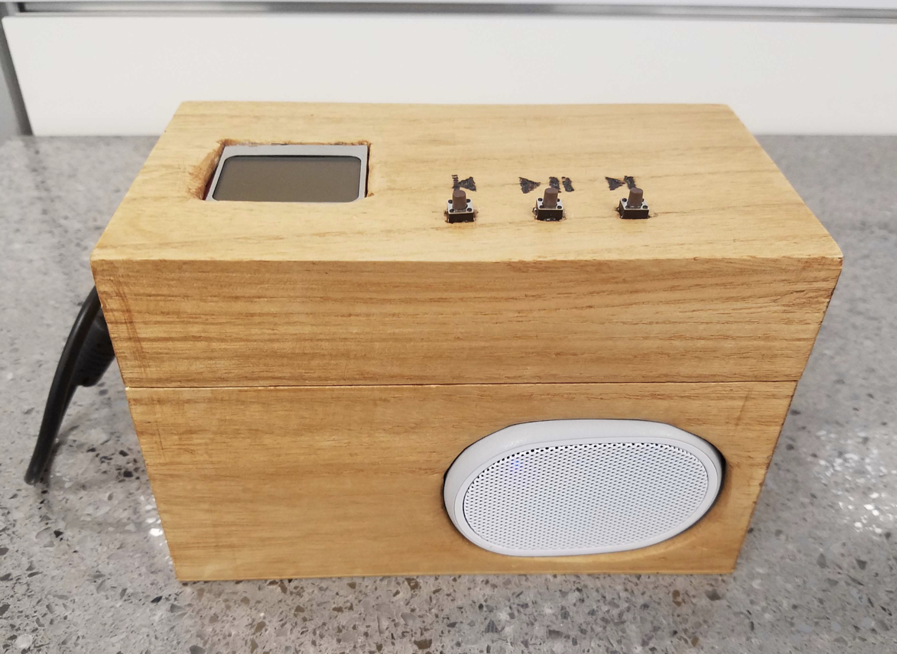

# 146 MP3 Project

## Device drivers go [here](https://github.com/LopezChris/MPTrio/tree/master/projects/lpc1758_freertos/L5_Application/mp3_devices)

Folder structure for applications, we'll be pulling the drivers from `MPTrio/projects/lpc1758_freertos/L2_Drivers/` and writing out application in L5_Application

[**lpc1758_freertos shortcut**](https://github.com/LopezChris/MPTrio/tree/master/projects/lpc1758_freertos)

Below is the structure for our application folder, so far only
**main.cpp**, **taks.hpp**, **mp3_player.cpp**, **NOKIA5110.hpp**, **NOKIA5110.cpp**, **runLCD.hpp**, and **runLCD.hpp** are relevant.

~~~bash
projects/lpc1758_freertos/L5_Application/
├── handlers.hpp
├── main.cpp
├── mp3_devices
│   ├── NOKIA5110.cpp
│   ├── NOKIA5110.hpp
│   └── application
│       └── LCDapp
│           ├── runLCD.cpp
│           ├── runLCD.hpp
│           ├── testLCD.cpp
│           └── testLCD.hpp
├── periodic_scheduler
│   ├── period_callbacks.cpp
│   ├── periodic_callback.h
│   └── prd_monitor.cpp
├── shared_handles.h
├── source
│   ├── cmd_handlers
│   │   ├── handlers.cpp
│   │   ├── prog_handlers.cpp
│   │   └── wireless_handlers.cpp
│   ├── high_level_init.cpp
│   ├── mainpage.h
│   ├── mp3_player.cpp
│   ├── remote.cpp
│   └── terminal.cpp
└── tasks.hpp
~~~

## Parts used

1. [LCD Screen Model](https://www.sparkfun.com/products/10168)
    - [Data sheet](https://www.sparkfun.com/datasheets/LCD/Monochrome/Nokia5110.pdf)
    - [Shortcut to Directory in Project](https://github.com/LopezChris/MPTrio/tree/master/projects/lpc1758_freertos/L5_Application/mp3_devices)
2. [Decoder Model](https://www.adafruit.com/product/1381)
    - [Library for application](https://github.com/LopezChris/Adafruit_VS1053_Library)
